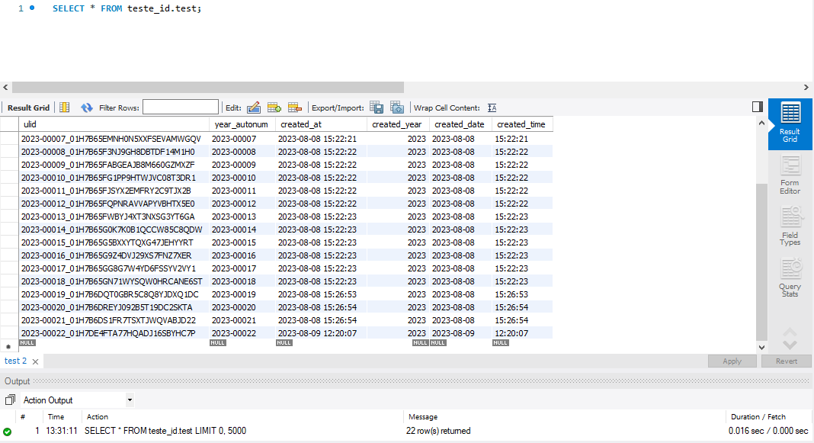

# MySQL: 

## 1 -  ID Customizado para sistema de chamados, sistema de ordem de serviço, etc.

Utlizado TRIGGER MySql para gerar ID customzida, utilizando o ano atual como parte do id.
No primeiro insert do ano, o ID é readequado para o ano vigente, e reiniciando a contagem do id, mas mantendo o histórico atenrior.

O ID customizado pode ser adaptada ao tamanho da aplicação.

Exemplo na imagem.

  

## 2 - Função ULIDs

[Exemplo]( https://stackoverflow.com/questions/75628114/append-a-column-with-an-ulid-to-an-existing-mysql-table)